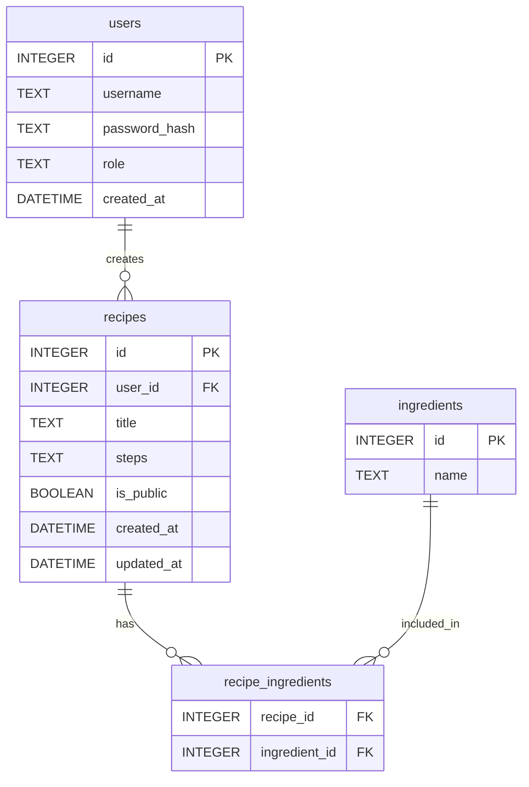

# 資料庫設計 (DB Design)

根據 PRD (食譜收藏夾系統) 需求所設計的 SQLite 資料庫結構。

## ER 圖 (實體關係圖)

## 資料表詳細說明

### 1. `users` (使用者)
| 欄位名稱 | 型別 | 屬性 / 說明 |
| --- | --- | --- |
| `id` | INTEGER | Primary Key, Autoincrement |
| `username` | TEXT | 必填，唯一值。 |
| `password_hash` | TEXT | 必填，密碼雜湊，確保安全。 |
| `role` | TEXT | 預設 'user'，可為 'admin' 以實現權限分離。 |
| `created_at` | DATETIME | 記錄建立時間。預設 CURRENT_TIMESTAMP |

### 2. `recipes` (食譜)
| 欄位名稱 | 型別 | 屬性 / 說明 |
| --- | --- | --- |
| `id` | INTEGER | Primary Key, Autoincrement |
| `user_id` | INTEGER | Foreign Key 對應 `users(id)` |
| `title` | TEXT | 必填，食譜名稱。 |
| `steps` | TEXT | 必填，食譜製作步驟。 |
| `is_public` | BOOLEAN | 預設 0 (False)，布林值判斷是否公開給全站看。 |
| `created_at` | DATETIME | 記錄建立時間。預設 CURRENT_TIMESTAMP |
| `updated_at` | DATETIME | 記錄更新時間。預設 CURRENT_TIMESTAMP |

### 3. `ingredients` (食材)
| 欄位名稱 | 型別 | 屬性 / 說明 |
| --- | --- | --- |
| `id` | INTEGER | Primary Key, Autoincrement |
| `name` | TEXT | 必填，唯一值，如「高麗菜」、「豬肉」。 |

### 4. `recipe_ingredients` (食譜-食材關聯表)
| 欄位名稱 | 型別 | 屬性 / 說明 |
| --- | --- | --- |
| `recipe_id` | INTEGER | Foreign Key 對應 `recipes(id)` |
| `ingredient_id` | INTEGER | Foreign Key 對應 `ingredients(id)` |
| 說明 | 複合主鍵 | `PRIMARY KEY (recipe_id, ingredient_id)` |
