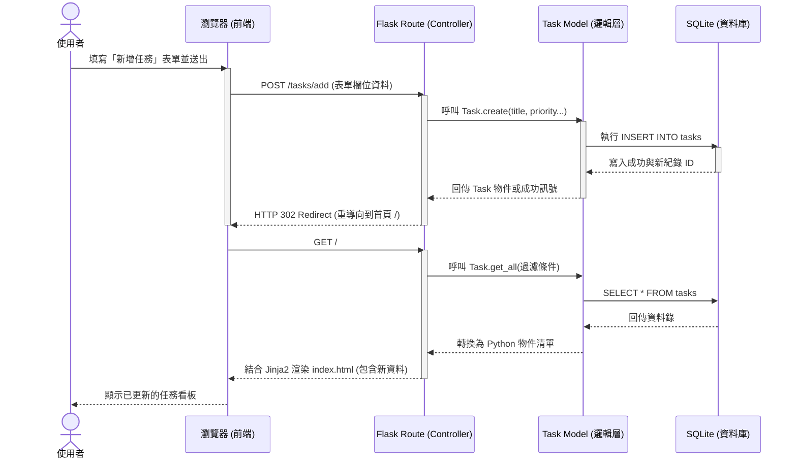

# 系統流程圖與操作路徑設計 (FLOWCHART.md)

這份文件根據 PRD 需求與 ARCHITECTURE 架構設計，視覺化「任務管理系統」的使用者互動流程與系統後端資料流。

## 1. 使用者流程圖 (User Flow)

這張圖展示了使用者進入網站後，可能經歷的各種功能與頁面跳轉行為。由於我們採用伺服器端渲染 (SSR)，所有的操作基本上都會圍繞著首頁 (任務列表) 進行。

```mermaid
flowchart LR
    A([使用者造訪首頁]) --> B[首頁 - 任務列表]
    B --> C{選擇操作}
    
    C -->|點擊「新增任務」| D[填寫新增小視窗/表單]
    D -->|送出表單| E[畫面重整並更新列表]
    
    C -->|點擊「篩選條件」| F[套用篩選顯示任務]
    F --> B
    
    C -->|編輯任務 (例如打勾完成)| G[發送狀態更新]
    G --> E
    
    C -->|點擊「刪除任務」| H[前端確認提示]
    H -->|確認刪除| I[送出刪除請求]
    I --> E
    
    E --> B
```

## 2. 系統序列圖 (Sequence Diagram)

以下序列圖展示了當使用者執行最常見的「**新增任務**」時，前端瀏覽器、Flask 後端、Model 層以及 SQLite 資料庫之間是如何互動與響應的。



## 3. 功能清單對照表

我們將前端操作對應到後端路由設計，此表將作為後續開發「API / 路由設計」的參考指標。

| 功能名稱 | URL 路由路徑 | HTTP 方法 | 描述與後續動作 |
| :--- | :--- | :--- | :--- |
| **首頁 (任務列表)** | `/` | `GET` | 讀取所有任務，支援 Query String (例如 `/?status=todo`) 進行篩選。 |
| **新增任務** | `/tasks/add` | `POST` | 接收表單資料，寫入資料庫後，重導回首頁 (`/`)。 |
| **編輯/更新任務狀態** | `/tasks/<int:task_id>/edit` | `POST` | 接收要修改的任務內容 (文字、狀態、優先順序)，更新 DB 後重導回首頁。 |
| **刪除任務** | `/tasks/<int:task_id>/delete`| `POST` | (為防範 CSRF，避免使用 GET) 刪除指定任務，刪除後重導回首頁。 |
